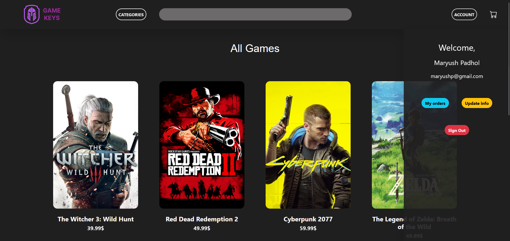
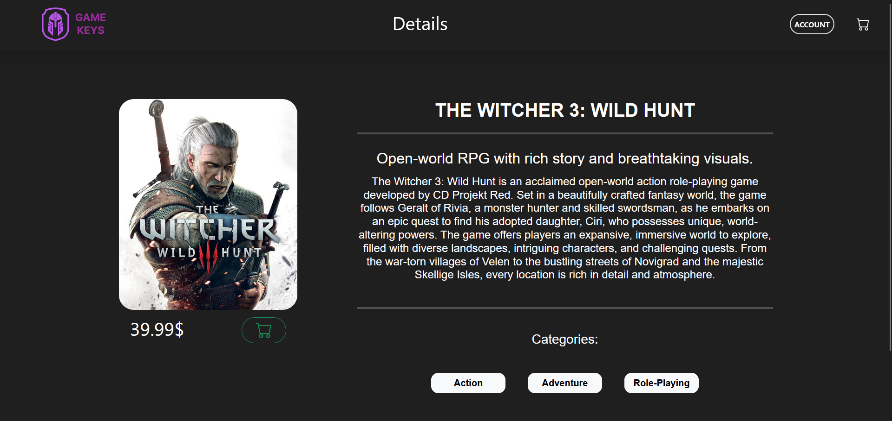
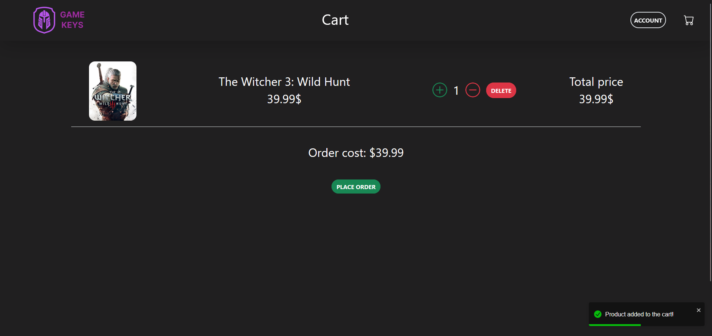
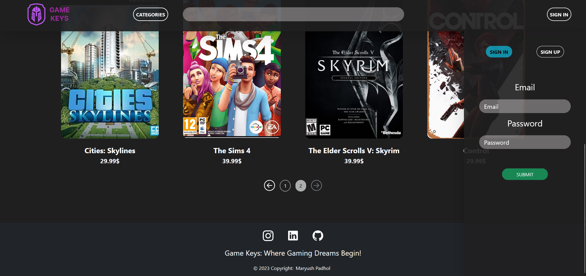
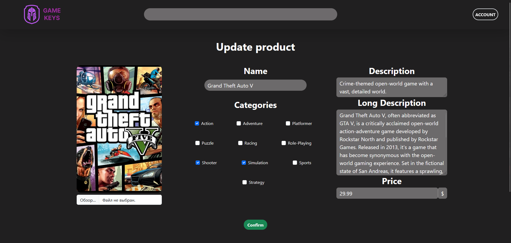

# Game Keys Store

Game Keys Store is an online platform built with JavaScript and React that allows users to explore and purchase keys for popular games. 
It interacts with the Webshop API to provide seamless integration with the [webshop project](https://github.com/maryushp/webshop).

___
## Features

### User Features

- **Browse Games:**
    - View a list of available games with detailed information.

- **Search and Filter:**
    - Search for specific games.
    - Filter games by categories for easy navigation.

- **Shopping Cart:**
    - Add games to the shopping cart.
    - Manage the cart by adjusting quantities or removing items.
    - Place an order for the selected games.

### Admin Features

- **Game Management:**
    - Add new games to the store.
    - Update game information.
    - Delete games from the inventory.

- **Order Management:**
    - View all user orders.
    - See a list of all orders made on the platform.
    - Change category names for better organization.
___

## Screenshots:

